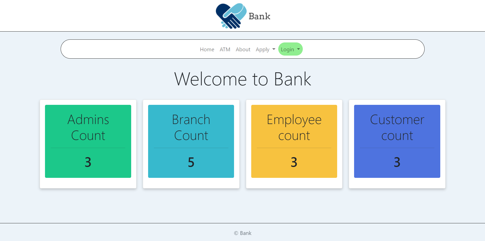

# Online Banking System

## About
A simple banking websites with most commonly used features



**Exhaustive list of features available in `about.php` file**

#Instructions to use
1. Install `XAMPP` and a code editor of your choice.
2. Download and import sql file through phpmyadmin.
3. Copy this folder into `htdocs` inside XAMPP folder.
4. Make sure you are running `Apache` and `MySQL`
5. Go to any web browser and enter the url below
```html
http://localhost/bank/index.php
```
You are now ready to explore the website

**Detailed installation instructions given in `instructions.pdf`**

## Frontend
1. `HTML v5`
2. `CSS v3 `
3. `Bootstrap v5`

## Backend
1. `PHP v7`

## Database
1. `MySQL`

## Software:
1. `XAMPP`
2. `Apache Server`
3. `MySQL`
4. `Visual Studio Code`

**For Credentials see `credentials.txt` file**

---

